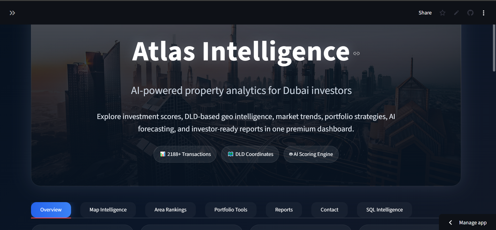
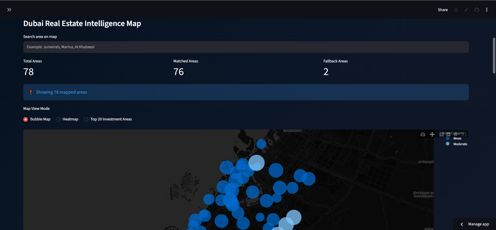
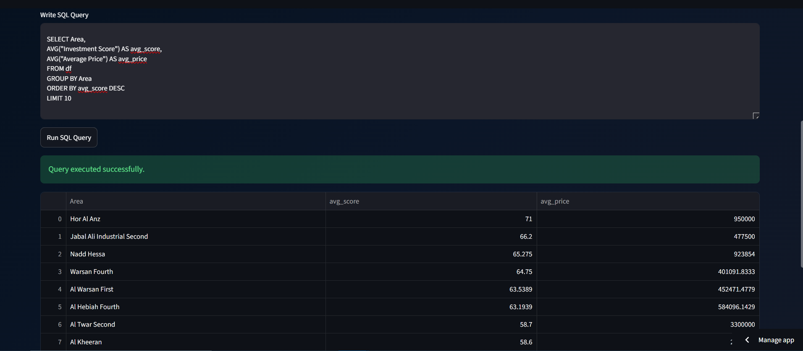

# Atlas Intelligence

AI-powered Dubai real estate analytics platform built using Python, Streamlit, Plotly, DuckDB, and real Dubai property transaction data.

### Live Application
https://atlas-intelligence-nqhavg9mkp7j5pxztwbtty.streamlit.app/

### GitHub Repository
https://github.com/syedkumailhaiderzaidi69-coder/Atlas-intelligence

---

## Dashboard Preview

---

## Dubai Geo Intelligence Mapping

---

## SQL Intelligence Engine

---

## Features

- Luxury executive dashboard UI
- Dubai real estate intelligence analytics
- Interactive geographic market visualization
- AI-generated investment recommendations
- AI-powered market sentiment engine
- Investment score rankings
- Market growth trend analysis
- Interactive AI assistant
- Product roadmap & methodology sections

---

## Technology Stack

- Python
- Streamlit
- Plotly
- Pandas
- NumPy
- DuckDB
- PostgreSQL
- Supabase
- scikit-learn
- SQLAlchemy
- GitHub
- Streamlit Cloud

---

## Backend Architecture Update

Atlas Intelligence now uses a cloud PostgreSQL database powered by Supabase.

Current architecture:

- Streamlit frontend
- Supabase PostgreSQL backend
- DuckDB SQL analytics layer
- scikit-learn machine learning models
- Plotly visualization engine
- GitHub + Streamlit Cloud deployment

The platform loads Dubai property transaction data directly from PostgreSQL, with CSV fallback support for reliability.

---

## Product Vision

Atlas Intelligence aims to evolve into a next-generation AI business intelligence ecosystem focused on Dubai real estate, investment analytics, and predictive market intelligence.

Future roadmap includes:
- Live market datasets
- Predictive pricing models
- Investor intelligence reports
- AI forecasting systems
- Real estate heatmaps
- Advanced analytics engine

---

## Author 

Syed Kumail Haider Zaidi
MSc Business Analytics  
University of Wollongong Dubai

---

## Project Status

Atlas Intelligence is an actively evolving Dubai real estate analytics platform built using Python, Streamlit, Plotly, DuckDB, and real Dubai property transaction datasets.

Current platform capabilities include:

* Interactive investment intelligence dashboard
* Dubai geo-intelligence mapping
* SQL-powered analytics querying using DuckDB
* Portfolio analysis tools
* AI-style investment scoring
* PDF report generation
* Responsive mobile-friendly UI

Upcoming enhancements:

* Machine learning price prediction
* Live API integrations
* Advanced forecasting models
* Automated data pipelines

This project is designed as a practical analytics engineering and business intelligence portfolio focused on Dubai real estate intelligence.

## Key Business Insights

Atlas Intelligence analyzes Dubai property transaction data to identify investment opportunities, growth patterns, and market intelligence signals.

Sample insights generated from the platform:

* Areas with the highest investment scores consistently showed stronger projected appreciation trends.
* Certain affordable communities demonstrated stronger rental-yield efficiency compared to premium luxury zones.
* Geographic clustering revealed concentrated investment momentum across key Dubai waterfront and growth corridors.
* Portfolio simulation tools highlighted how diversified allocation strategies can reduce concentration risk.
* SQL-powered analytics enabled dynamic area-level comparisons and transaction intelligence queries.

The platform is designed to support data-driven investment decision making using interactive analytics and business intelligence workflows.

